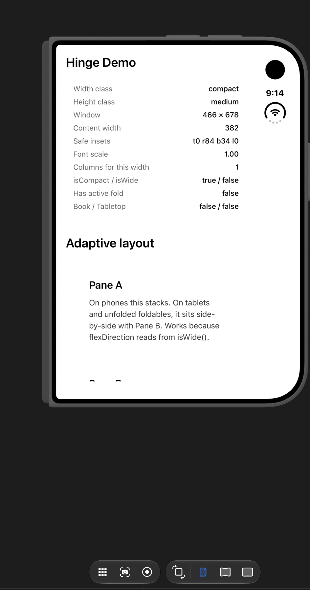
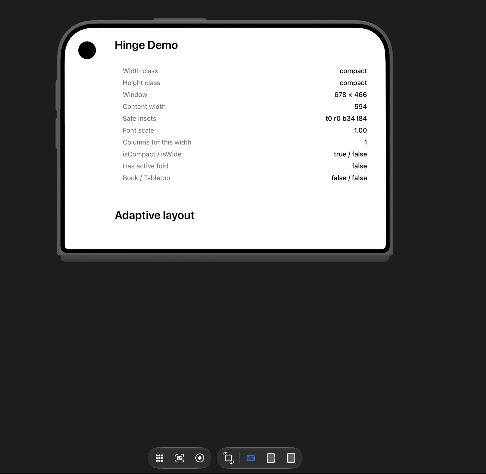
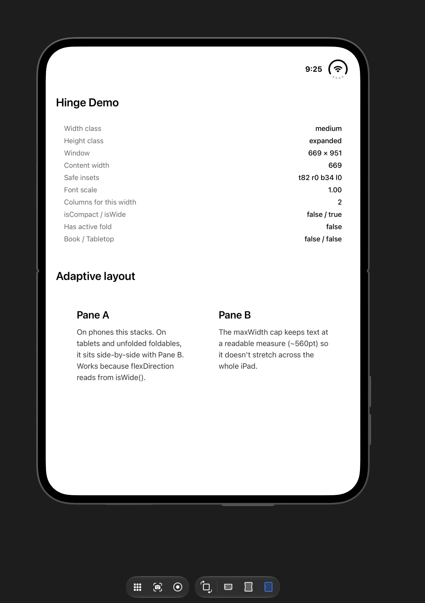
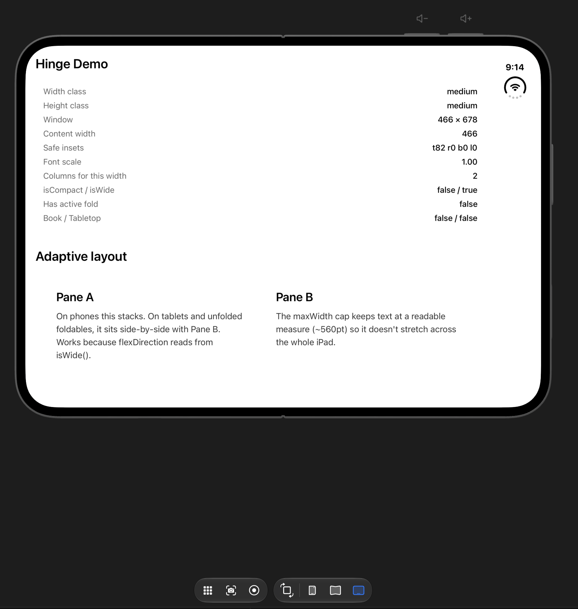
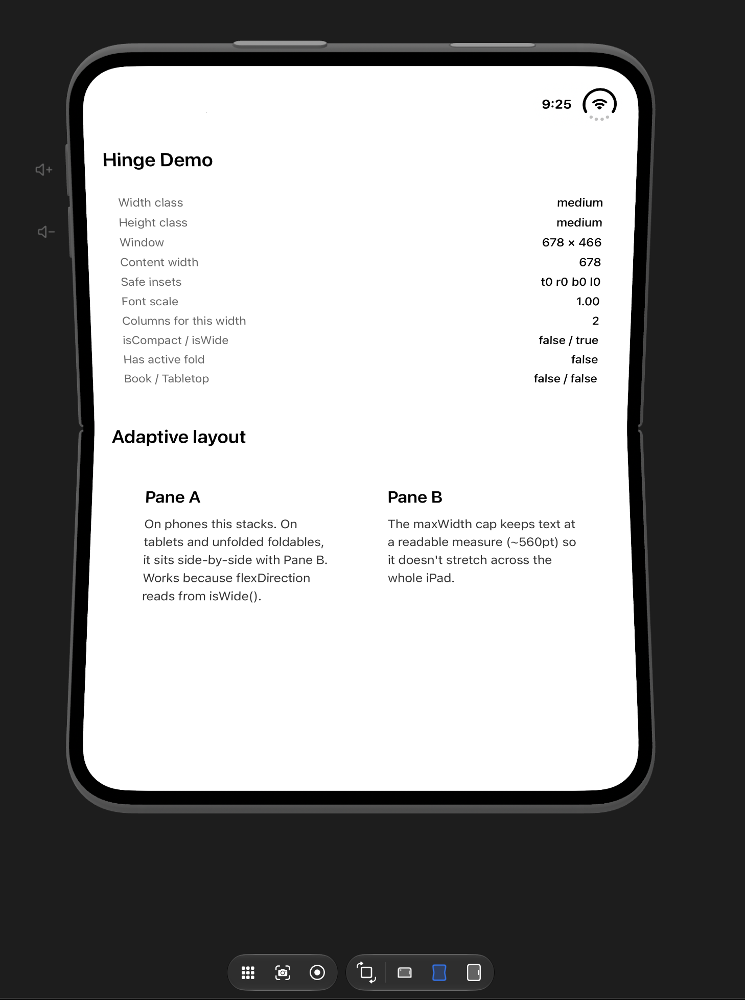
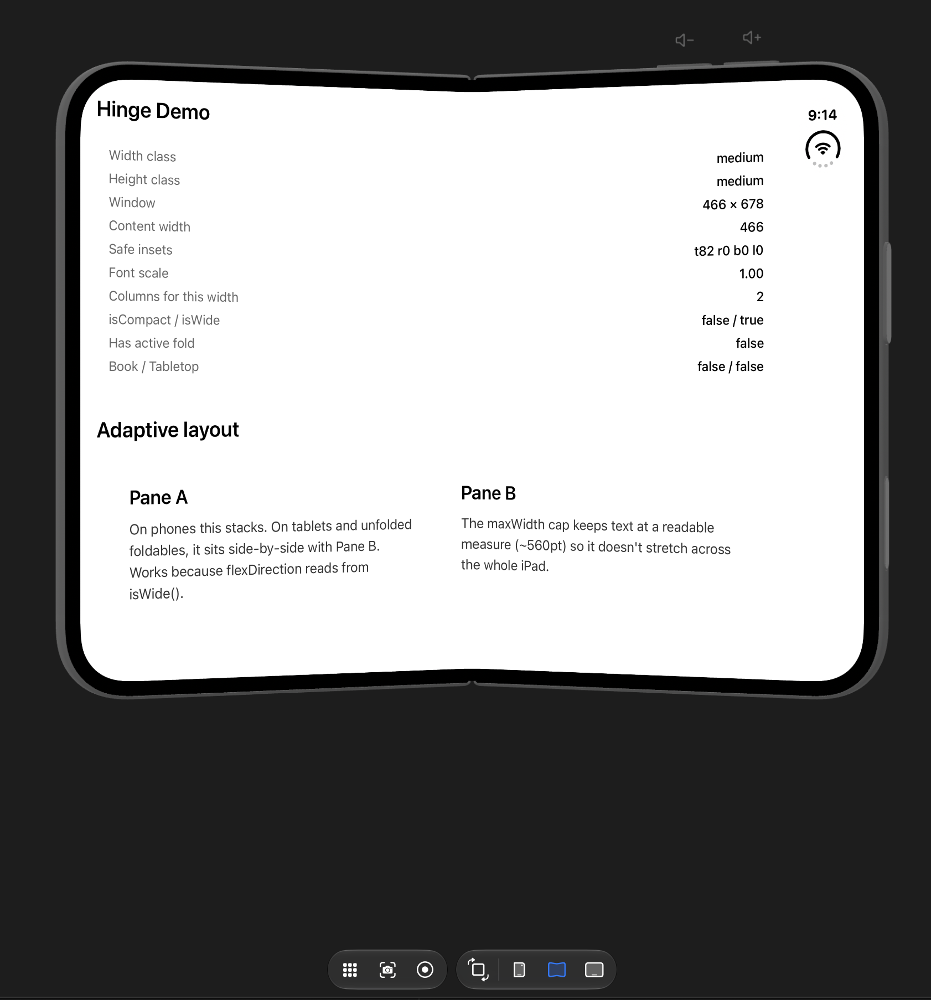

<a href="https://gauthamvijay.com">
  <picture>
    
  </picture>
</a>

# react-native-nitro-hinge

Native size class, safe insets, and hinge geometry for React Native.
Nitro-backed. iOS + Android. One API for phones, tablets, foldables,
tri-folds, iPhone Duo — and whatever ships next.

> **Status: v1.0.0** — iOS is production-ready and verified
> across all 6 iPhone Duo poses on the Xcode 27.1 beta simulator.
> Android returns correct values at cold-start but state-change
> propagation on WindowInfoTracker is still being tuned; expect
> full parity in v2.0.0. See [Status by platform](#status-by-platform) below.

## Verified on iPhone Duo (Xcode 27.1 beta)

Six configurations, six correct readings, zero manual work:

<table>
  <tr>
    <td align="center"><strong>Outer portrait</strong><br/>compact<br/>1 column<br/>vertical bar right</td>
    <td align="center"><strong>Outer landscape</strong><br/>compact<br/>1 column<br/>vertical bar left</td>
    <td align="center"><strong>Inner flat portrait</strong><br/>medium<br/>2 columns</td>
  </tr>
  <tr>
    <td></td>
    <td></td>
    <td></td>
  </tr>
  <tr>
    <td align="center"><strong>Inner flat landscape</strong><br/>expanded<br/>3 columns</td>
    <td align="center"><strong>Inner unfolded portrait</strong><br/>medium × expanded<br/>tablet-shape</td>
    <td align="center"><strong>Inner unfolded landscape</strong><br/>expanded<br/>widest window</td>
  </tr>
  <tr>
    <td></td>
    <td></td>
    <td></td>
  </tr>
</table>

Every value in every screenshot is what UIKit + iOS 27.1 reserved
regions actually report, marshalled through Nitro's synchronous JSI
bridge and rendered in a React Native example app with no manual
polling, no bridge hops, no JS-side heuristics.

**No other React Native library currently does this.**

## Status by platform

| Platform          | Signals         | Reactive updates | Fold detection | Notes                                                                                                                                      |
| ----------------- | --------------- | ---------------- | -------------- | ------------------------------------------------------------------------------------------------------------------------------------------ |
| **iOS 13.4 – 26** | ✅              | ✅               | n/a            | Size class, safe insets, font scale, orientation.                                                                                          |
| **iOS 27.1+**     | ✅              | ✅               | ✅             | Full `reservedRegions(kind: .division)` on Duo. Requires Xcode 27.1 beta and `HINGE_IOS_27_1_SDK=1` in podspec.                            |
| **iPadOS**        | ✅              | ✅               | n/a            | Split View, Stage Manager, Slide Over all reflow correctly.                                                                                |
| **Android**       | ✅ (cold-start) | ⚠️               | ⚠️             | Correct values on module load and on config changes. WindowInfoTracker flow subscription being tuned — expect production parity in v2.0.0. |

If you're shipping for iPhone Duo October 23, Hinge is ready today.
If you need production-grade Android foldable support right now, wait
for beta.2 or open an issue — the pipeline is 90% there, the last 10%
is real-time fold-state fanout on emulator/device.

## Why this exists now

The foldable market moved from "someday" to "shipping in production"
in the last 90 days:

- **September 9, 2026** — Apple announced iPhone Duo alongside iPhone 18 Pro
- **September 18, 2026** — Xcode 27.1 beta released with iPhone Duo SDKs and simulator
- **October 23, 2026** — iPhone Duo goes on sale in ~70 countries
- **December 2025** — Samsung Galaxy Z TriFold launched (first shipping tri-fold)
- **August 2026** — Huawei Pura X Max, Mate XT2 tri-fold, Xiaomi 18 Fold all launched in China
- **2026 forecast** — 20–27M foldable units shipped globally, ~2% of all phones
- **2027 forecast** — 23–36M units, Apple projected to hit 40% market share
- **Cumulative** — 100M foldable devices in customer hands by end of 2027

Every React Native app in the store now has to handle:

1. iPhone Duo's outer display (compact width), inner display in
   portrait and landscape (medium/expanded width), and half-folded
   poses that reserve a vertical bar on one side
2. Samsung and Google foldables that reflow between cover screen
   and inner display, and half-open poses for tabletop/book layouts
3. Samsung TriFold and future Apple foldables with multiple
   simultaneous hinges
4. iPad Split View, Stage Manager, and Android tablets that already
   break naive `Dimensions.get('window')` code
5. Asymmetric safe areas caused by the vertical bars foldable
   platforms put on the trailing edge in landscape

`Dimensions.get('window')` snapshots at read time. `Platform.isPad`
is a coarse device check. `StyleSheet.create` freezes numbers at
module load. None of them handle any of the above correctly.

## What Hinge does

Hinge is a **data source**, not a styling engine. It surfaces the
signals Apple and Google both bless for adaptive layouts — size
class, measured window, asymmetric safe insets, hinge geometry —
directly to JS via Nitro's synchronous JSI bridge. Reads work
inside `StyleSheet.create` at module load, and a hook subscribes
to live changes on fold, rotate, split view resize, and stage
manager gestures.

**Bring your own styles.** Pair with `StyleSheet.create` factory
patterns, Unistyles, NativeWind, or anything else.

## Foldable devices covered

Hinge works on every foldable that ships Android's `WindowInfoTracker`
or iOS 27.1's `reservedRegions` API. That's every foldable currently
in the market:

### iOS

| Vendor | Device                              | Form factor            | Support                                                 |
| ------ | ----------------------------------- | ---------------------- | ------------------------------------------------------- |
| Apple  | iPhone Duo                          | Book-style (2-panel)   | ✅ Full via iOS 27.1                                    |
| Apple  | Future foldable iPad (rumored 2028) | Book-style or tri-fold | ✅ Same code path — `foldFeatures[]` scales to N hinges |

### Android — book-style (2-panel)

The dominant Android form factor. All book-style foldables use the
same `WindowInfoTracker` API and report a single `FoldingFeature`
per hinge.

| Vendor             | Series                     | Latest devices                                        | Market position                                                |
| ------------------ | -------------------------- | ----------------------------------------------------- | -------------------------------------------------------------- |
| **Samsung**        | Galaxy Z Fold              | Z Fold 6, Z Fold 7, Z Fold 8 (2026)                   | 32–38% global foldable share                                   |
| **Huawei**         | Mate X, Pura X             | Mate X7, Pura X Max, Mate XT2 (Sept 2026)             | 22–24% global, 57% in China H1 2026                            |
| **Google**         | Pixel Fold                 | Pixel Fold, Pixel 9 Pro Fold, Pixel 10 Pro Fold       | 2–3% global, growing                                           |
| **Motorola**       | Razr (book-style variants) | Razr 70 series                                        | 8% global                                                      |
| **Honor**          | Magic V                    | Magic V3, V5, V6 (fastest growth: 82% YoY in Q2 2026) | 3–9% global, growing fast                                      |
| **Xiaomi**         | Mix Fold                   | Mix Fold 3, Mix Fold 4, Xiaomi 18 Fold (Sept 2026)    | 1–2% global, mostly China                                      |
| **OPPO / OnePlus** | Find N                     | Find N3 / OnePlus Open                                | Paused new releases as of 2025, existing units still in market |
| **vivo**           | X Fold                     | X Fold 3, X Fold 3 Pro                                | China-focused, growing                                         |

### Android — clamshell (Flip-style, hinge across the middle)

Clamshells report as `compact` width class in every pose because
the outer screen is small and the inner unfolds to a normal phone
shape, not a tablet shape. Tabletop (flex mode) posture is
detected via `foldFeatures[i].orientation === 'horizontal'`.

| Vendor       | Series        | Latest devices                  |
| ------------ | ------------- | ------------------------------- |
| **Samsung**  | Galaxy Z Flip | Z Flip 6, Z Flip 7, Z Flip 7 FE |
| **Motorola** | Razr          | Razr 70, Razr Ultra 2026        |
| **Honor**    | Magic Flip    | (China-focused)                 |
| **Xiaomi**   | Mix Flip      | (China-focused)                 |
| **OPPO**     | Find N Flip   | (China-focused)                 |

### Android — tri-fold (three panels, two hinges)

The newest form factor. Hinge reports `foldFeatures.length === 2`
when both hinges are half-open. No code changes needed by
consumers — the array API handles it naturally.

| Vendor      | Device                  | Launch                          |
| ----------- | ----------------------- | ------------------------------- |
| **Samsung** | Galaxy Z TriFold        | Dec 2025 (Korea), Jan 2026 (US) |
| **Huawei**  | Mate XT, Mate XT2       | Mate XT2 launched Sept 2026     |
| **Apple**   | Foldable iPad (rumored) | 2028 forecast                   |

### Devices that do NOT need Hinge

- Regular phones (iPhone 15, Pixel 9, Galaxy S25, etc.) — Hinge
  returns `widthClass: compact`, `foldFeatures: []`, works fine
- Regular tablets (iPad Air, Galaxy Tab S10) — Hinge returns
  `widthClass: medium` or `expanded` based on Split View state,
  `foldFeatures: []`
- Wearables (Apple Watch, Wear OS) — Hinge doesn't target these
- TV / CarPlay / Vision Pro — out of scope

## Global foldable market — September 2026 snapshot

Data from Counterpoint Research, TrendForce, IDC, and SAG.
Numbers are consensus estimates; different trackers vary ±10%.

**Full-year 2026 (in-year forecast at Duo launch):**

| Vendor                        | Share        | Shipments 2026 | Notes                                                      |
| ----------------------------- | ------------ | -------------- | ---------------------------------------------------------- |
| Samsung                       | 32–38%       | ~7.1M          | Z Fold 7/8 driving growth, Z TriFold expanding form factor |
| Apple                         | 25%          | ~5–10M         | iPhone Duo, first year, only 2 months on sale              |
| Huawei                        | 22–24%       | ~5M            | China-dominant, 57% H1 2026 share in China alone           |
| Motorola                      | 8%           | ~2M            | Razr 70 series                                             |
| Honor                         | 3–9%         | ~1M            | Magic V6, fastest growth vendor (82% YoY Q2 2026)          |
| Xiaomi + OPPO + vivo + Google | ~5% combined | ~1M            | Regional/emerging players                                  |

**Full-year 2027 forecasts (already released):**

- Total foldable market: **23.5M–36M units** (37% YoY growth,
  fastest since 2022)
- **Apple: 40% share** — 20–25M iPhone Duo shipments in first
  full year of availability
- Cumulative foldable devices in customer hands: **100M** by end
  of 2027

Foldables are still only ~2% of total smartphone shipments, but
they're the fastest-growing premium segment. Every RN app targeting
premium/enterprise/creator markets already has foldable users.

## Install

```bash
yarn add react-native-nitro-hinge react-native-nitro-modules
cd ios && pod install
```

Requires:

- React Native 0.75+
- iOS 13.4+ (fold geometry needs iOS 27.1+; falls back gracefully)
- Android API 24+ (fold geometry via `androidx.window` 1.5+)
- Xcode 16.4+ (Xcode 27.1 beta for iPhone Duo fold detection)
- Nitro 0.37+

Without this flag, Hinge builds and ships against Xcode 27.0 SDK
just fine — you get every non-fold signal (size class, safe insets,
orientation, font scale). `foldFeatures` returns empty until the
flag is enabled and you're building against 27.1.

## Quick start

### Static styles (module load)

```typescript
import { StyleSheet, View, Text } from 'react-native';
import { hinge, font, space, isWide } from 'react-native-nitro-hinge';

const styles = StyleSheet.create({
  container: {
    padding: space(16),
    flexDirection: isWide() ? 'row' : 'column',
  },
  title: { fontSize: font(24) },
});

function Screen() {
  return <View style={styles.container}><Text style={styles.title}>Hi</Text></View>;
}
```

### Reactive styles (reflow on fold, rotate, split view)

```typescript
import { useMemo } from 'react';
import { StyleSheet, View } from 'react-native';
import { useHinge, font, space, isWide } from 'react-native-nitro-hinge';

const makeStyles = () => StyleSheet.create({
  container: {
    padding: space(16),
    flexDirection: isWide() ? 'row' : 'column',
  },
  title: { fontSize: font(24) },
});

function Screen() {
  const { widthClass } = useHinge();
  const styles = useMemo(makeStyles, [widthClass]);
  return <View style={styles.container}>...</View>;
}
```

## API

### State

```typescript
hinge.widthClass; // 'compact' | 'medium' | 'expanded'
hinge.heightClass; // 'compact' | 'medium' | 'expanded'
hinge.windowWidth; // measured window width (pt / dp)
hinge.windowHeight; // measured window height
hinge.safeInsets; // { top, right, bottom, left } — asymmetric-aware
hinge.foldFeatures; // array of active folds; empty on non-foldables
hinge.hingeAngle; // continuous angle for animations only (nullable)
hinge.fontScale; // OS Dynamic Type / Configuration.fontScale
hinge.deviceInfo; // { platformVersion, model, hasHardwareHinge } — analytics only
```

### Scaling helpers

```typescript
font(16); // size-class-based bump, respects Dynamic Type
space(16); // scales more aggressively for tablets
size(48); // sub-linear scaling for containers
radius(8); // sub-linear for corners
icon(24); // same as size
hairline(1); // PixelRatio-aware, always 1px
responsive({ compact: 1, medium: 2, expanded: 3 });
```

### Layout queries

```typescript
isCompactWidth(); // phone-shape layout
isWide(); // tablet-shape layout (medium or expanded)
hasActiveFold(); // any active fold in current window
isSeparating(); // any active fold separates content into panes
isTriFold(); // 2+ simultaneous active folds (Samsung TriFold, future Apple)
isBookPosture(); // half-open + vertical fold (two-page layout)
isTabletopPosture(); // half-open + horizontal fold (video-above / controls-below)
contentWidth(); // width inside safe area, asymmetric-safe
contentHeight(); // height inside safe area
```

### Reactive hook

```typescript
const state = useHinge(); // subscribes to all state changes
```

## What it does NOT expose (and why)

Missing on purpose. These are **anti-patterns** on at least one
platform:

- ❌ `isIPad()` / `Platform.isPad` for layout — `Platform.isPad`
  works and correctly reports iPad, but it's a coarse device check.
  On iPhone Duo the inner display is regular width _on a phone_:
  `isPad` returns false but the layout should be tablet-like.
  Same in reverse on iPad Split View at compact widths. Use
  `widthClass === 'expanded'` or `isWide()` — ask the window,
  not the device.
- ❌ `isDuo()` / `isFold()` — model checks are fragile across
  vendors, wrong on outer displays where the device is still a
  fold but the app should look like a phone. Use `hasActiveFold()`
  or `foldFeatures.length > 0`.
- ❌ `pose` enum for layout — Apple's guidance is explicit: use
  size class for layout, hinge state for content-arrangement
  decisions like tabletop/book. `foldFeatures[i].state` is
  exposed for this; general layout branching should key off
  `widthClass`.
- ❌ Aspect-ratio font scaling — the classic `(height/width) *
multiplier` hack. Broken on every rotation, every fold, every
  split view. Use Dynamic Type + a small size-class bump instead.

## Comparison to alternatives

| Concern                        | `Dimensions.get('window')` | `useWindowDimensions` | Hinge                |
| ------------------------------ | -------------------------- | --------------------- | -------------------- |
| Reactive to rotate             | ❌                         | ✅                    | ✅                   |
| Reactive to fold               | Partial                    | Partial               | ✅ (native listener) |
| Reactive to Split View         | ❌                         | ✅                    | ✅                   |
| Size class exposed             | ❌                         | ❌                    | ✅                   |
| Asymmetric safe insets handled | ❌                         | ❌                    | ✅                   |
| Hinge geometry                 | ❌                         | ❌                    | ✅                   |
| iOS 27.1 reservedRegions       | ❌                         | ❌                    | ✅                   |
| Tri-fold (multiple hinges)     | ❌                         | ❌                    | ✅                   |
| Sync at module load            | ✅                         | ❌ (hook only)        | ✅                   |
| Font scale                     | ✅                         | ✅                    | ✅                   |

Vs. other RN foldable libraries:

| Library                                  | Platform        | Nitro       | iOS Duo | Tri-fold | Size class | Status                     |
| ---------------------------------------- | --------------- | ----------- | ------- | -------- | ---------- | -------------------------- |
| `@logicwind/react-native-fold-detection` | Android only    | ❌          | ❌      | ❌       | ❌         | Alpha                      |
| `@hecom/react-native-foldable`           | JS-only wrapper | ❌          | ❌      | ❌       | ❌         | Not native                 |
| `marcooli/react-native-foldable`         | iOS + Android   | ❌ (Fabric) | Partial | ❌       | ❌         | 0.1.0-alpha, not published |
| **`react-native-nitro-hinge`**           | iOS + Android   | ✅          | ✅      | ✅       | ✅         | v1.0.0                     |

## Position vs. styling engines

Hinge is a **data source**. It answers _"what window am I in?"_
It doesn't answer _"how do I write styles that reflow?"_ That's
what styling engines do.

- **Hinge alone** — factory `StyleSheet.create` + hook pattern.
  Good for bare-workflow apps that don't want a styling dependency.
- **Hinge + Unistyles** — use Hinge as Unistyles' runtime state
  source for Duo pose, hinge geometry, and asymmetric insets that
  Unistyles doesn't have out of the box.
- **Hinge + NativeWind** — use Hinge for the "what's the current
  breakpoint" question inside NativeWind's hooks.

## Roadmap

- **v1.0.0** (current) — iOS complete across all six Duo
  poses, size classes on iPad and iPhone, WindowInfoTracker wired
  on Android with correct cold-start values.
- **v2.0.0** — Android fold-state fanout via
  WindowInfoTracker flow, verified on Pixel 10 Pro Fold and
  Samsung Z Fold emulators.
- **v3.0.0** (target: iPhone Duo launch, Oct 23 2026) — stable
  release aligned with iOS 27.1 GM.

## Reference material

- iOS: [Apple's iPhone Duo HIG](https://developer.apple.com/design/human-interface-guidelines/designing-for-iphone-duo)
- iOS: [Preparing your app for iPhone Duo](https://developer.apple.com/documentation/uikit/preparing-your-app-for-iphone-duo)
- Android: [Window size classes](https://developer.android.com/develop/adaptive-apps/guides/use-window-size-classes)
- Android: [Make your app fold-aware](https://developer.android.com/develop/adaptive-apps/guides/foldables/make-your-app-fold-aware)
- Android: [Support tri-folds and landscape foldables](https://developer.android.com/develop/adaptive-apps/guides/foldables/trifolds-and-landscape-foldables)
- Samsung: [Foldable developer docs](https://developer.samsung.com/galaxy-z/foldable-experience)

For device-specific metrics on every foldable in the market, see
[`references/android-foldables-device-metrics.md`](./references/android-foldables-device-metrics.md).

## License

MIT — [Gautham](https://nitroai.dev) / nitroai.dev
